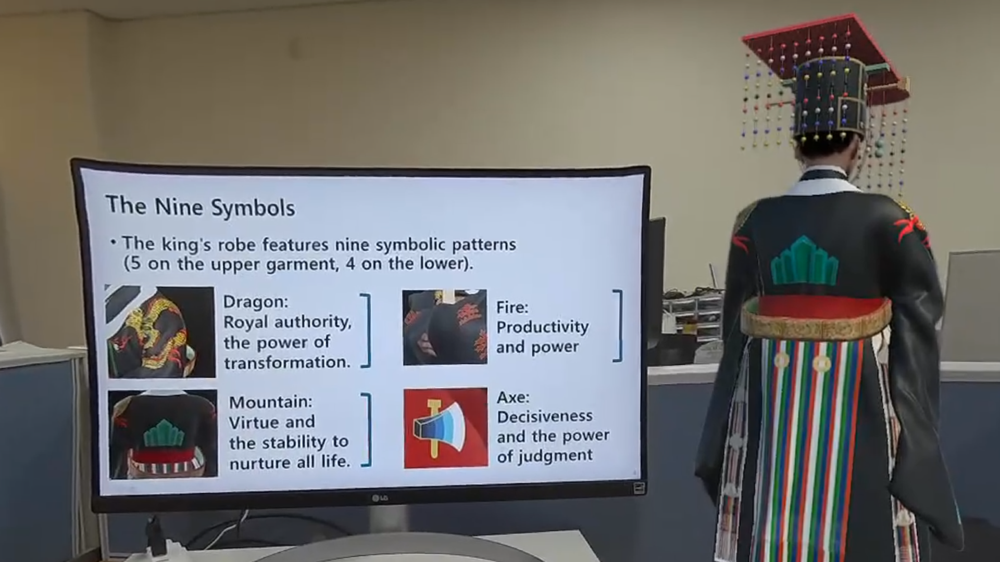
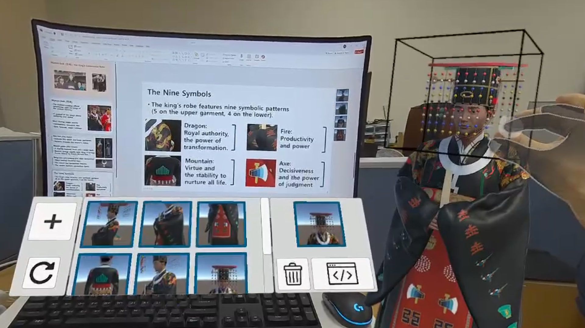

# SpatialSlides

  
  

SpatialSlides is a system that integrates immersive authoring directly into slide-based presentation workflows. (Left) Viewing Mode: The 3D model synchronizes with the slide. (Right) Authoring Mode: The user captures a snapshot to link a spatial view.

The system is implemented as a decoupled client-server architecture that unifies the workflow:

1.  **Python Middleware**: A server that runs on the desktop and manages the PowerPoint instance via the Windows COM API. It monitors the active slide deck for changes.
2.  **Unity Client**: An immersive XR application (Meta Quest 3) that renders the 3D content.

These components communicate via ZeroMQ. The middleware synchronizes the 3D view with the slide deck in real-time and injects authoring commands (snapshots) directly into the presentation file.

## Repository Structure

This project is modularized into two separate repositories. Please clone the specific component you need:

* **[SpatialSlides_XRClient](https://github.com/JungWhoNam/SpatialSlides_XRClient)**
    The XR application built in Unity. It contains the virtual stage, authoring widgets, and the logic for smooth transitions between spatial keyframes.

* **[SpatialSlides_PythonMiddleware](https://github.com/JungWhoNam/SpatialSlides_PythonMiddleware)**
    The bridge application running on Windows. It handles the communication between the Unity client and Microsoft PowerPoint.

## Demo Presentations

This repository includes the three PowerPoint (.pptx) files used in the user study evaluation. You can use these to test the system:

* **Buddha**: Demonstrates spatial authoring on a detailed sculpture.
* **Haetae**: Demonstrates the system's ability to handle mythical creatures and complex forms.
* **King**: Demonstrates the royal attire learning module.

## Quick Start Guide

To run the full SpatialSlides system, you must run both components simultaneously:

1.  **Start PowerPoint**: Open one of the included demo .pptx files on Windows.
2.  **Run the Middleware**: Navigate to the SpatialSlides_PythonMiddleware directory and execute the server script. It will hook into the active PowerPoint instance.
3.  **Run the Client**: Open the SpatialSlides_XRClient project and play the corresponding Widget scene.

## Acknowledgments

The 3D models used in this project are courtesy of the Ministry of Culture, Sports and Tourism from South Korea.